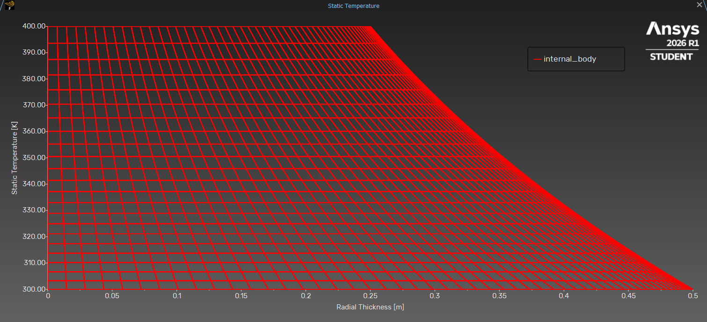

# CFD-Radial-Conduction-Analysis-Ansys
Steady-State Heat Conduction | ANSYS Fluent 2026 R1
<p align="center">


</p>

---

# 📖 Repository Overview

This repository presents a **2D steady-state Computational Fluid Dynamics (CFD)** simulation of **radial heat conduction through a solid annular geometry** performed using **ANSYS Fluent 2026 R1**.

The primary objective of this project is to investigate how thermal energy propagates through a cylindrical solid when a constant temperature difference is imposed between the inner and outer walls.

Although radial heat conduction is one of the fundamental heat transfer problems taught in engineering, CFD enables engineers to visualize the complete temperature field, quantify thermal gradients, and better understand conductive heat transfer beyond analytical calculations.

This project serves as a foundational exercise in **heat transfer modelling, numerical simulation, mesh generation, solver configuration, and post-processing within the ANSYS Fluent environment.**

---

> **Engineering Focus**
>
> Understanding radial heat conduction in cylindrical solids through numerical simulation and interpreting the resulting thermal behaviour using Computational Fluid Dynamics.

---


## 📷 Repository Preview

<p align="center">



</p>

---

# 📑 Table of Contents

- [📖 Repository Overview](#-repository-overview)

- [🎯 Project Objectives](#-project-objectives)

- [🌡️ Governing Physics](#️-governing-physics)

- [🧩 Geometry Creation](#-geometry-creation)

- [🕸️ Mesh Generation](#️-mesh-generation)

- [⚙️ Solver Setup](#️-solver-setup)

- [🧱 Material Properties](#-material-properties)

- [🚪 Boundary Conditions](#-boundary-conditions)

- [📉 Solution & Convergence](#-solution--convergence)

- [📊 Results & Post-Processing](#-results--post-processing)

- [🧠 Engineering Discussion](#-engineering-discussion)

- [✅ Validation](#-validation)

- [💡 Key Learnings](#-key-learnings)

- [📂 Repository Structure](#-repository-structure)

- [🚀 Future Improvements](#-future-improvements)


---

# 🎯 Project Objectives

This project was undertaken to develop a numerical understanding of **steady-state radial heat conduction** in a cylindrical solid using Computational Fluid Dynamics (CFD). While analytical solutions provide mathematical expressions for temperature distribution, CFD enables engineers to visualize thermal behaviour throughout the entire domain and better interpret the underlying heat transfer mechanisms.

The primary objectives of this study are:

- Investigate the radial temperature distribution within a 2D annular solid domain.

- Visualize conductive heat transfer resulting from a prescribed temperature difference between the inner and outer walls.

- Develop an understanding of thermal diffusion under steady-state conditions.

- Evaluate the influence of mesh quality on numerical accuracy and solution stability.

---

# 📚 Engineering Background

Heat transfer is one of the three fundamental modes of energy transport, occurring through **conduction, convection,** and **radiation**. In solid materials, thermal energy is primarily transferred by **conduction**, where heat flows from regions of higher temperature to regions of lower temperature due to molecular interactions.

One of the most common conduction problems encountered in engineering involves **radial heat transfer through cylindrical geometries**. Unlike one-dimensional planar conduction, the cross-sectional area available for heat transfer changes continuously with radius, resulting in a **non-linear temperature distribution** throughout the material.

Understanding this behaviour is essential in the design and thermal analysis of numerous engineering systems, including:

- Heat exchanger
- Pressure vessels
- Thermal insulation systems
- Nuclear reactor components
- Rotating machinery
- Aerospace propulsion systems

Although analytical solutions accurately predict temperature variation for idealized cases, they provide only mathematical results at discrete locations. Computational Fluid Dynamics complements these solutions by solving the governing energy equation over the entire computational domain, allowing engineers to visualize complete temperature fields, thermal gradients, and heat flow paths.

This project therefore serves as an introductory yet essential CFD study, bridging classical heat transfer theory with modern numerical simulation techniques.

---

# 🌡️ Governing Physics

The present analysis considers **steady-state heat conduction** through a homogeneous isotropic solid annulus.

The simulation is based on the following assumptions:

- Two-dimensional planar analysis
- Steady-state conditions
- Pure solid conduction
- No internal heat generation

Under these assumptions, thermal energy is transferred exclusively by molecular conduction from the hotter inner surface toward the cooler outer surface until thermal equilibrium is established.

The governing physical mechanism is described by **Fourier's Law of Heat Conduction**, which states that heat flows in the direction of decreasing temperature and is proportional to the local temperature gradient.

As the simulation reaches convergence, the resulting temperature field represents the steady-state solution in which the rate of heat entering the annulus equals the rate of heat leaving it, satisfying the principle of conservation of energy throughout the computational domain.

---


# 🧩 Geometry Creation

The computational model represents a **2D annular solid domain** designed to investigate steady-state radial heat conduction through a hollow cylindrical structure.

The geometry consists of two concentric circles forming an annulus, where the inner surface is maintained at a higher temperature than the outer surface. This simplified configuration accurately represents radial conduction while eliminating unnecessary geometric complexity.

By adopting a two-dimensional planar model, the computational cost is significantly reduced without compromising the accuracy of the underlying conduction physics.

---

## 📐 Geometry Specifications

| Parameter | Value |
|-----------|------:|
| Geometry Type | 2D Annular Solid Domain |
| Inner Diameter | 0.5 m |
| Outer Diameter | 1.0 m |
| Analysis Type | 2D Steady-State |

---

## 📷 Geometry

<p align="center">


</p>

> **Figure 1:** Computational geometry representing the annular solid domain used for radial heat conduction analysis.

---

# 🕸️ Mesh Generation

The computational domain was discretized using a **structured quadrilateral mesh** to accurately resolve the temperature field while maintaining excellent numerical stability.

Quadrilateral elements are generally preferred for structured thermal analyses because they provide improved numerical accuracy, lower discretization error, and smoother interpolation of temperature gradients compared to unstructured triangular meshes.

A structured mesh also ensures a more uniform element distribution throughout the annular domain, allowing the solver to capture radial heat diffusion efficiently.

---

## 📊 Mesh Specifications

| Parameter | Value |
|-----------|------:|
| Mesh Type | Structured Quadrilateral |
| Number of Cells | 4,752 |
| Number of Faces | 9,720 |
| Number of Nodes | 4,968 |
| Minimum Orthogonal Quality | 0.999 |
| Maximum Aspect Ratio | 1.82 |

---

## 📷 Mesh

<p align="center">


</p>

> **Figure 2:** Structured quadrilateral mesh generated for the computational domain.

---

## 📈 Mesh Quality Assessment

The accuracy of any CFD simulation depends strongly on mesh quality. Poor-quality elements can introduce excessive numerical diffusion, reduce solution accuracy, and negatively affect convergence behaviour.

The generated mesh demonstrates excellent quality, ensuring reliable numerical performance throughout the simulation.

### Mesh Quality Evaluation

| Quality Metric | Assessment |
|---------------|-----------|
| Orthogonal Quality | Excellent |
| Aspect Ratio | Acceptable |
| Element Distribution | Uniform |
| Numerical Stability | High |

The minimum orthogonal quality of **0.999** indicates an exceptionally well-constructed mesh with minimal geometric distortion. Likewise, the maximum aspect ratio of **1.82** falls well within acceptable engineering limits, ensuring accurate resolution of thermal gradients without compromising numerical stability.

These quality indicators provide confidence that the numerical solution primarily reflects the governing physics rather than mesh-induced errors.

---


# ⚙️ Solver Setup

The simulation was performed using a **2D pressure-based steady-state solver** in **ANSYS Fluent 2026 R1** to analyze radial heat conduction through the annular solid domain.

---

## ⚙️ Solver Configuration

| Setting | Configuration |
|---------|---------------|
| Solver Type | Pressure-Based |
| Analysis | Steady-State |
| Space | 2D |
| Energy Equation | Enabled |
| Time | Steady |

---

## 🌡️ Material Properties

**Material:** Structural Steel

| Property | Value |
|---------|------:|
| Density | 8030 kg/m³ |
| Specific Heat | 502.48 J/kg·K |
| Thermal Conductivity | 16.27 W/m·K |

---

## 🚪 Boundary Conditions

A constant temperature difference was imposed across the annular solid to establish radial heat flow.

| Boundary | Condition |
|----------|-----------|
| Inner Wall | 400 K |
| Outer Wall | 300 K |

---

## 🧮 Numerical Methods

| Parameter | Method |
|-----------|--------|
| Spatial Discretization | Second Order |
| Solution Initialization | Hybrid Initialization |

The second-order scheme improves numerical accuracy by reducing discretization errors in the computed temperature field.

---

# 📉 Convergence

The solution converged smoothly with stable residual behavior.

### Convergence Summary

| Parameter | Status |
|-----------|--------|
| Energy Residual | Converged |
| Iterations | 15 |
| Solution Stability | Stable |

---

## 📷 Residual Plot

<p align="center">


</p>

> **Figure 3:** Residual history showing stable convergence of the energy equation.

---

## 💡 Engineering Note

A prescribed temperature difference between the inner and outer walls creates the thermal gradient that drives radial heat conduction. Once the energy residual converges, the computed temperature field represents the steady-state thermal equilibrium within the annular domain.


# 📊 Results & Discussion

The simulation successfully captured the steady-state radial heat conduction through the annular solid domain. The temperature field exhibited the expected radial distribution, with thermal energy flowing continuously from the heated inner wall toward the cooler outer wall.

---

## 📷 Temperature Contours

<p align="center">


</p>

> **Figure 4:** Temperature distribution across the annular solid.

---

## 🔍 Key Observations

- Maximum temperature occurred at the inner heated wall (400 K).
- Temperature decreased progressively toward the outer wall (300 K).
- No localized thermal irregularities were observed.

---

## 🧠 Engineering Discussion

The simulation demonstrates the fundamental principles of **steady-state conduction** in cylindrical coordinates. Unlike planar conduction, radial heat transfer occurs through an area that varies with radius, producing a non-linear temperature distribution.

The smooth temperature contours and stable convergence indicate that the numerical solution accurately represents the expected physical behaviour of radial heat conduction.

---

# ✅ Validation

The numerical results are consistent with the theoretical behaviour of radial heat conduction through a hollow cylinder.

| Validation Parameter | Status |
|----------------------|--------|
| Radial Temperature Distribution | ✅ Verified |
| Heat Flow Direction | ✅ Correct |
| Steady-State Behaviour | ✅ Achieved |
| Numerical Stability | ✅ Stable |

---

# 💡 Key Learnings

- Application of CFD to solid heat transfer problems.
- Importance of high-quality structured meshes.
- Visualization of temperature gradients using CFD.
---

# 📂 Repository Structure

```text
CFD-Radial-Heat-Transfer/
│
├── README.md
├── .gitignore
│
├── Gallery/
│   ├── Project_Cover.png
│   ├── Geometry.png
│   ├── Mesh.png
│   ├── Temperature_Contour.png
│   └── Residuals.png
│
└── Documentation/
    └── Project_Report.pdf
```

---

# 🚀 Future Improvements

Potential extensions of this project include:

- Transient heat conduction
- Conjugate heat transfer
- Internal heat generation
- Temperature-dependent material properties
- Mesh independence study
- Three-dimensional analysis

---

# 👨‍💻 Author

**Shrinivas**

Aspiring CFD Engineer | Mechanical Engineer

Passionate about **Computational Fluid Dynamics, Heat Transfer, Fluid Mechanics, and Aerodynamics**, with a focus on developing simulation-driven engineering solutions through ANSYS Fluent.

### 🌐 Connect with Me

<p align="left">

<a href="https://www.linkedin.com/in/shrinivas471/" target=_blank">

</a>

<a href="https://github.com/shrinivas073" target="_blank">

</a>

<a href="https://www.notion.so/Aspiring-CFD-Engineer-Aerodynamics-ANSYS-Fluent-Fluid-Dynamics-Flow-Thermal-Analysis-Tur-398644a1903c8045bbc4e377269b809d?source=copy_link" target="_blank">

</a>

</p>

---

## ⭐ Support

If you found this repository useful or informative, consider giving it a **⭐ Star**. Your support motivates me to continue documenting and sharing my CFD learning journey.

---


